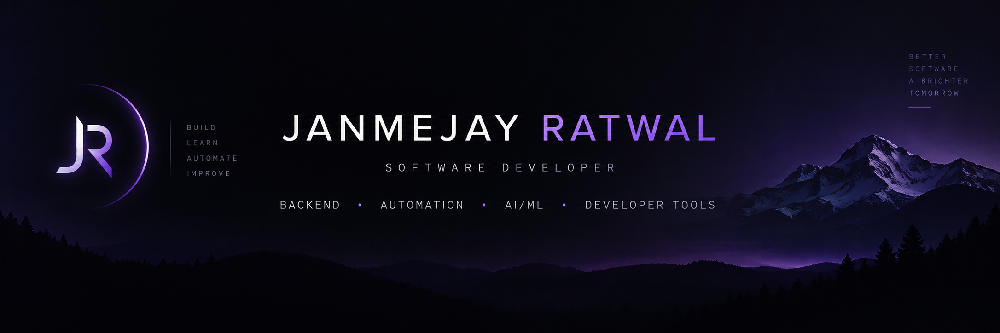

  

# Hi, I'm Janmejay 👋

### Software Developer • Backend • Automation • AI/ML

I build **developer tools, backend systems, and intelligent automation** that solve practical problems.

My work sits at the intersection of:

**Software Engineering → Backend Development → Automation → AI/ML**

---

## 🚀 What I'm Building

### RepoPatcher
An AI-powered developer tool for detecting errors in GitHub repositories, analyzing failures, and assisting with automated code repair.

> Currently in development.

### Candidate Ranker
A candidate ranking system designed to efficiently process and evaluate candidate data using **multiprocessing and parallel execution**.

[View Repository →](https://github.com/JanmejayRatwal/Candidate-Ranker)

### Spam Email Detection
A machine learning system that classifies emails as **spam or legitimate** using text-based features and supervised learning.

[View Repository →](https://github.com/JanmejayRatwal/Email-Spam-Detection)

---

## 🛠️ Tech Stack

### Languages & Development

  

### AI / ML & Backend

  

  <strong>AI / ML:</strong> Machine Learning · NLP · LLMs · Scikit-learn

  <strong>Backend:</strong> Flask · APIs · Automation · Parallel Processing

## 📊 GitHub Activity

  

## 🔭 Currently Exploring

- AI-assisted software engineering
- Automated code analysis and repair
- Backend systems and APIs
- LLM-powered developer tools
- Intelligent automation

---

## 🌐 Find Me

**Portfolio:** [janmejayr.com](https://janmejayr.com)

**LinkedIn:** [linkedin.com/in/janmejayratwal](https://www.linkedin.com/in/janmejayratwal/)

**GitHub:** [github.com/JanmejayRatwal](https://github.com/JanmejayRatwal)

---

### Building software that actually works.
